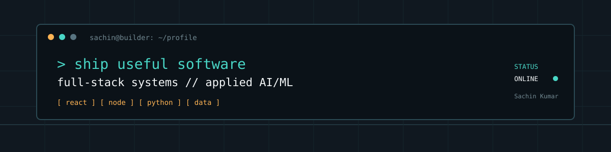

# Sachin Kumar

### Software Engineer | Full Stack & Backend Developer | Applied AI/ML

Full-stack applications, backend services, and practical AI/ML prototypes.

---

## About Me

I build full-stack products and backend services with React, TypeScript, JavaScript, Node.js, Express, and Python. My public work spans a deployment-ready portfolio, a PostgreSQL-backed shop management system, real-time communication projects, and applied AI/ML experiments.

I am focused on backend-aware product engineering: clear user workflows, dependable APIs, practical data persistence, and software that is easy to inspect.

## Currently Building

- Full-stack products with React, TypeScript, JavaScript, Node.js, and Express
- Backend workflows with authentication, PostgreSQL, SQLite, and contact-data persistence
- Real-time browser experiences using WebSocket and WebRTC concepts
- Applied Python and machine-learning prototypes, including resume screening and recommendation experiments

## Tech Stack

<table>
<tr>
<td valign="top" width="50%"><strong>Languages</strong>  

</td>
<td valign="top" width="50%"><strong>Frontend</strong>  

</td>
</tr>
<tr>
<td valign="top"><strong>Backend and Real-time</strong>  

</td>
<td valign="top"><strong>Data and Delivery</strong>  

</td>
</tr>
</table>

## Featured Projects

<table>
<tr>
<td valign="top" width="50%"><strong><a href="https://github.com/Sachin1885/Portfolio">Developer OS Portfolio</a></strong>  
<em>Personal developer workspace that makes projects and activity easy to explore.</em>  
<strong>Key features:</strong> project explorer, GitHub activity, contact form, SQLite persistence, and admin access.  
React · TypeScript · Tailwind · Node.js · Express · SQLite 
<a href="https://portfolio-10sv.onrender.com/">Live demo</a>
</td>
<td valign="top" width="50%"><strong><a href="https://github.com/Sachin1885/-Grocery-Shop-Manager">Grocery Shop Manager</a></strong>  
<em>Operations dashboard for running inventory, billing, and shop credit workflows.</em>  
<strong>Key features:</strong> inventory, billing, sales history, credit accounts, JWT authentication, admin controls, and PWA support.  
JavaScript · Node.js · Express · PostgreSQL 
<a href="https://github.com/Sachin1885/-Grocery-Shop-Manager">Source code</a>
</td>
</tr>
<tr>
<td valign="top"><strong><a href="https://github.com/Sachin1885/DarkType">DarkType Backend</a></strong>  
<em>Real-time backend foundation for a cross-platform chat application.</em>  
<strong>Key features:</strong> Node/Express backend, MongoDB integration, and Socket.io real-time communication support.  
Node.js · Express · MongoDB · Socket.io 
<a href="https://github.com/Sachin1885/DarkType">Source code</a>
</td>
<td valign="top"><strong><a href="https://github.com/Sachin1885/Chat-app">Chat App</a></strong> fork  
<em>Room-based messaging experience built around live browser communication.</em>  
<strong>Key features:</strong> create and join rooms, real-time messaging, and automatic deletion of empty rooms.  
React · TypeScript · Vite · Node.js · WebSocket 
<a href="https://chat-app-theta-mocha-19.vercel.app">Live demo</a>
</td>
</tr>
<tr>
<td valign="top"><strong><a href="https://github.com/Sachin1885/Vidloom">Vidloom</a></strong> fork  
<em>Peer-to-peer video and data communication across browsers.</em>  
<strong>Key features:</strong> WebRTC connections, WebSocket signaling, SDP/ICE exchange, and STUN/TURN support.  
React · TypeScript · WebRTC · WebSocket 
<a href="https://vidloom.netlify.app/">Live demo</a>
</td>
<td valign="top"><strong><a href="https://github.com/Sachin1885/AI-Resume-Screening-System">AI Resume Screening</a></strong> fork  
<em>Machine-learning prototype for resume screening and job matching.</em>  
<strong>Key features:</strong> resume analysis, skill matching, and a Streamlit interface. Presented transparently as an exploration.  
Python · Streamlit · scikit-learn · NLP 
<a href="https://ai-resume-screening-system.streamlit.app/">Live demo</a>
</td>
</tr>
</table>

## GitHub Statistics

| Public repositories | Followers | Following | Contributions in last year |
| ---: | ---: | ---: | ---: |
| 23 | 1 | 1 | 44 |

Verified snapshot from August 23, 2026. GitHub profile counts change over time.

	
	

Streak and activity visuals are generated from public GitHub activity by the linked services. If an external image is unavailable, use the native [GitHub profile](https://github.com/Sachin1885) and [contributions view](https://github.com/Sachin1885?tab=contributions) below.

## Contribution Activity

Follow the live [contribution graph](https://github.com/Sachin1885) and [monthly activity](https://github.com/Sachin1885?tab=contributions) directly on GitHub. Recent public activity includes ongoing work on the Portfolio repository and the profile README repository.

Top-language percentages are intentionally omitted because the tested language-statistics endpoint was unavailable. The repository list remains the authoritative [source for language metadata](https://github.com/Sachin1885?tab=repositories).

## Certifications / Learning

Current public work points toward deeper backend engineering and applied AI/ML. No degree, internship, certification, or course credential is publicly listed, so none is claimed here.

## Let's Connect

Email and LinkedIn are not publicly listed on the current profile.

For professional conversations, visit the [portfolio](https://portfolio-10sv.onrender.com/) or [GitHub profile](https://github.com/Sachin1885). A verified LinkedIn link can be added when available.

---

Profile README maintained for Sachin1885. Project details are based on publicly visible repositories and may change as the work evolves.
